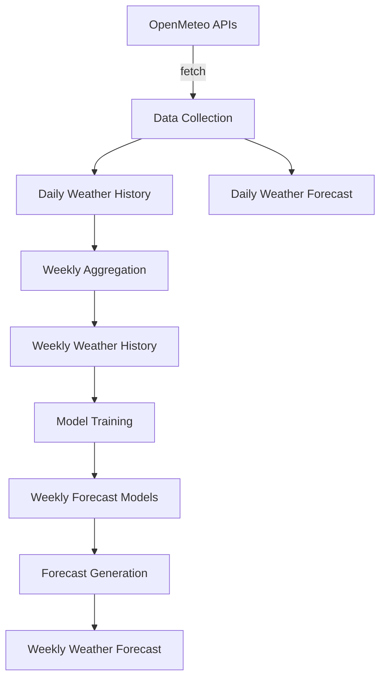

# Weather Service

A comprehensive weather data management and forecasting system built with Python, providing automated data collection, machine learning-based forecasting, and service-oriented architecture for weather applications.

## Overview

The Weather Service is a modular, containerized system for weather data management and forecasting. It provides automated data collection from OpenMeteo APIs, database management with PostgreSQL, machine learning-based weekly forecasting using Vector Autoregression models, and a complete service ecosystem for weather applications.

## Architecture

### Core Components

- **[`weather_models`](weather_models/)**: SQLAlchemy ORM models, database management, and ML capabilities
- **[`openmeteo_client`](openmeteo_client/)**: OpenMeteo API client with rate limiting and data processing
- **[`build_service`](build_service/)**: Docker-based Python wheel distribution builder

### Service Ecosystem

- **[`bootstrap_service`](bootstrap_service/)**: Initial database setup and data population
- **[`daily_maintenance_service`](daily_maintenance_service/)**: Daily data updates and health checks
- **[`weekly_maintenance_service`](weekly_maintenance_service/)**: Weekly data aggregation
- **[`forecast_build_service`](forecast_build_service/)**: Machine learning model training
- **[`forecast_service`](forecast_service/)**: Weather forecast generation

### Configuration

- **[`config/`](config/)**: Centralized configuration files for development and production

## Features

### Data Management

- **Comprehensive Database Schema**: Standardized weather measurements across daily/weekly, historical/forecast tables
- **Geographic Indexing**: Efficient spatial queries via latitude/longitude coordinates
- **Temporal Indexing**: Optimized date and time-based operations
- **Data Integrity**: Unique constraints, validation, and automated health checks
- **Bootstrap Detection**: Prevents accidental data loss during initialization

### API Integration

- **OpenMeteo APIs**: Historical weather data and numerical weather predictions
- **Multi-tier Rate Limiting**: Automatic backoff across minutely/hourly/daily windows
- **Geographic Processing**: Coordinate grid generation and multi-location optimization
- **Data Aggregation**: Daily-to-weekly conversion using meteorological best practices
- **Request Caching**: 24-hour HTTP cache for performance optimization

### Machine Learning

- **Vector Autoregression Models**: Location-specific weekly weather forecasting
- **Automatic Optimization**: BIC-based lag order selection for optimal performance
- **Stationarity Handling**: First-order differencing and undifferencing
- **Model Persistence**: Save and load trained models using joblib
- **Geographic Specialization**: Tailored forecasts for each coordinate

### Service Infrastructure

- **Containerized Services**: Docker-based deployment with service isolation
- **Automated Scheduling**: Daily and weekly maintenance routines
- **Health Monitoring**: Data completeness validation and gap detection
- **Error Handling**: Comprehensive error management with detailed logging
- **Session Management**: Proper database connection handling and cleanup

## Quick Start

### Prerequisites

- Docker and Docker Compose
- PostgreSQL database
- Python 3.13+ (for local development)

### Environment Variables

```bash
# Database Configuration
POSTGRES_USER=weatheruser
POSTGRES_PASSWORD=weatherpass
POSTGRES_HOST=localhost
POSTGRES_PORT=5432
POSTGRES_DB=weatherdb
```

### Building Core Packages

```bash
# Build Python wheels for core packages
cd build_service
docker build --target weather-build-service -t weather-build .
docker create --name wheel-extractor weather-build
docker cp wheel-extractor:/wheels ./dist/
docker rm wheel-extractor
```

### Service Deployment

```bash
# Bootstrap initial data
docker build -t bootstrap-service bootstrap_service/
docker run --env-file .env bootstrap-service

# Start maintenance services
docker build -t daily-maintenance daily_maintenance_service/
docker build -t weekly-maintenance weekly_maintenance_service/

# Build and run forecast services
docker build -t forecast-build forecast_build_service/
docker build -t forecast-service forecast_service/

# Schedule services (example with cron)
# Daily: 0 2 * * * docker run --env-file .env daily-maintenance
# Weekly: 0 3 * * 3 docker run --env-file .env weekly-maintenance
# Model Build: 0 4 1 * * docker run --env-file .env forecast-build
# Forecasts: 0 5 * * * docker run --env-file .env forecast-service
```

## System Workflow

### Data Flow Pipeline

### Data Flow Pipeline



### Service Orchestration

1. **Bootstrap Phase**: Initial database setup and historical data population
2. **Daily Operations**: Data updates, forecast refresh, and health checks
3. **Weekly Operations**: Data aggregation and weekly summary creation
4. **Model Training**: Location-specific forecast model building
5. **Forecast Generation**: Weekly weather predictions using trained models

## API Reference

### Core Packages

#### weather_models

```python
from weather_models import WeatherDatabase, WeeklyForecastModel

# Database operations
db = WeatherDatabase()
if db.bootstrap:
    db.create_tables()

# Machine learning
model = WeeklyForecastModel(location=(40.7, -74.0))
model.build_model(historical_data)
forecast = model.forecast(horizon=4, data=historical_data)
```

#### openmeteo_client

```python
from openmeteo_client import OpenMeteoArchiveClient, OpenMeteoClientConfig

# API configuration
config = OpenMeteoClientConfig(create_from_file=True)

# Data retrieval
client = OpenMeteoArchiveClient(config)
historical_data = client.main()
```

### Database Schema

#### Common Weather Measurements

| Column | Type | Description |
|--------|------|-------------|
| `latitude` | Float | Geographic latitude coordinate |
| `longitude` | Float | Geographic longitude coordinate |
| `temperature_2m_mean` | Float | Mean temperature (°C) at 2m height |
| `temperature_2m_max` | Float | Maximum temperature (°C) at 2m height |
| `temperature_2m_min` | Float | Minimum temperature (°C) at 2m height |
| `cloud_cover_mean` | Float | Mean cloud cover percentage |
| `cloud_cover_max` | Float | Maximum cloud cover percentage |
| `cloud_cover_min` | Float | Minimum cloud cover percentage |
| `wind_speed_10m_mean` | Float | Mean wind speed (km/h) at 10m height |
| `wind_speed_10m_min` | Float | Minimum wind speed (km/h) at 10m height |
| `wind_speed_10m_max` | Float | Maximum wind speed (km/h) at 10m height |
| `sunshine_duration` | Float | Sunshine duration (seconds) |
| `precipitation_sum` | Float | Total precipitation (mm) |
| `precipitation_hours` | Float | Total precipitation (hours) |

#### Data Tables

- **DailyWeatherHistory**: Historical daily weather observations
- **DailyWeatherForecast**: Daily weather forecast predictions
- **WeeklyWeatherHistory**: Aggregated weekly historical data
- **WeeklyWeatherForecast**: Weekly forecast predictions with source tracking

## Configuration

### OpenMeteo Client Configuration

```json
{
    "history_start_date": "2001-01-01",
    "history_end_date": "latest",
    "forecast_days": 16,
    "forecast_past_days": 1,
    "bounding_box": {
        "north": 71.0,
        "south": 36.0,
        "west": 9.0,
        "east": 68.0
    },
    "metrics": [
        "temperature_2m_mean",
        "temperature_2m_max",
        "temperature_2m_min",
        "cloud_cover_mean",
        "cloud_cover_max",
        "cloud_cover_min",
        "wind_speed_10m_mean",
        "wind_speed_10m_min",
        "wind_speed_10m_max",
        "sunshine_duration",
        "precipitation_sum",
        "precipitation_hours"
    ]
}
```

### Forecast Service Configuration

```json
{
    "horizon": 4
}
```

## Service Details

### Bootstrap Service

Initializes the weather service database and populates it with historical data:

- Creates all required database tables
- Retrieves comprehensive historical weather data
- Fetches current forecast data
- Generates weekly aggregations from daily data
- Prevents accidental data overwrites via bootstrap detection

### Daily Maintenance Service

Maintains data freshness and integrity:

- Updates historical data with 2-day rollover period
- Refreshes daily weather forecasts
- Performs health checks for data completeness
- Automatically repairs data gaps

### Weekly Maintenance Service

Aggregates daily data into weekly summaries:

- Runs on Wednesdays to process previous completed week
- Converts daily historical data to weekly statistics
- Updates WeeklyWeatherHistory table
- Ensures data availability for model training

### Forecast Build Service

Trains machine learning models for weather prediction:

- Retrieves unique locations from WeeklyWeatherHistory
- Builds location-specific WeeklyForecastModel instances
- Trains VAR models using historical weekly data
- Saves trained models for forecast generation

### Forecast Service

Generates weekly weather forecasts:

- Loads trained models for each location
- Uses historical data for forecast input
- Generates configurable horizon predictions
- Updates WeeklyWeatherForecast table

## Performance Characteristics

### Rate Limiting

OpenMeteo API integration includes comprehensive rate limiting:

| Window | Limit | Backoff |
|--------|-------|---------|
| Minutely | 600 requests | 61 seconds |
| Hourly | 5,000 requests | 1 hour |
| Daily | 10,000 requests | 24 hours |

### API Costs

- **Historical Data**: 31.3 API units per location-year
- **Forecast Data**: 1.2 API units per location

### Geographic Coverage

- **Default Resolution**: 0.5° spacing (~55km at equator)
- **Configurable Boundaries**: Flexible bounding box specification
- **Multi-location Processing**: Efficient batch operations

## Development

### Local Setup

```bash
# Clone repository
git clone <repository-url>
cd weather_service

# Set up environment variables
touch .env

# Start PostgreSQL database
docker-compose up -d database

# Install development dependencies using Poetry
poetry install

# Activate virtual environment
poetry env activate

# Build packages locally (optional)
cd weather_models
poetry build

cd ../openmeteo_client
poetry build
```

### Docker Compose Development

```bash
# Start database only
docker compose up -d database

# Build build service
docker compose build build-service

# Build services
docker compose build bootstrap-service forecast-build-service forecast-service daily-maintenance-service weekly-maintenance-service

# Run bootstrap service to initialize data
docker compose up bootstrap-service

# Run individual services
docker compose up forecast-build-service
docker compose up forecast-service
docker compose up daily-maintenance-service
docker compose up weekly-maintenance-service

# Build wheels only
docker compose up build-service
```

### Environment Configuration

Create a `.env` file with development settings:

```bash
# Docker Compose service versions
BUILD_SERVICE_VERSION=latest
BOOTSTRAP_SERVICE_VERSION=latest
FORECAST_BUILD_SERVICE_VERSION=latest
WEATHER_FORECAST_SERVICE_VERSION=latest
DAILY_MAINTENANCE_SERVICE_VERSION=latest
WEEKLY_MAINTENANCE_SERVICE_VERSION=latest

# Database configuration (matches docker-compose.yaml)
POSTGRES_HOST=localhost
POSTGRES_PORT=5432
POSTGRES_DB=weatherdb
POSTGRES_USER=myuser
POSTGRES_PASSWORD=pw
CONFIG_FILE=dev_config.json
```

### Adding New Services

1. Create service directory with `Dockerfile`
2. Implement service logic using core packages
3. Add service to `docker-compose.yaml`
4. Add environment variables to `.env`
5. Include health checks and error handling

### Adding New Core Packages

1. Create package directory
2. Set up project using poetry and pyproject.toml
3. Create your models
4. Define imports in *\_\_init\_\_.py*
5. Add to *build_service* configuration
6. Create usage guide

## Dependencies

### Core Dependencies

- **SQLAlchemy**: ORM and database abstraction
- **pandas**: Data manipulation and analysis
- **psycopg2**: PostgreSQL database adapter
- **statsmodels**: Statistical modeling and VAR implementation
- **openmeteo_requests**: Official OpenMeteo SDK

### Service Dependencies

- **Docker**: Container runtime for service deployment
- **PostgreSQL**: Primary database backend
- **Python 3.13+**: Runtime environment for all services

### Performance Optimization

**Database Performance**:
- Ensure proper indexing on geographic and temporal columns
- Monitor query performance and optimize as needed
- Consider connection pooling for high-throughput scenarios

**API Performance**:
- Implement request caching for repeated queries
- Use geographic batching for multi-location requests
- Monitor rate limit usage and adjust request patterns

---

**Weather Service** - Comprehensive weather data management and forecasting system